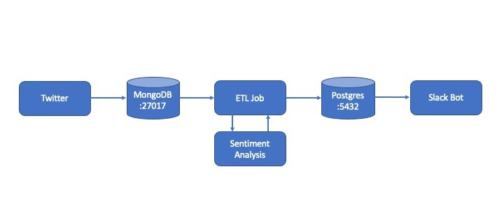

# Dockerized Data Pipeline for Sentiment Anaylsis of Tweets
\
Data Pipeline

## Project Description
The goal of the project is to collect tweets of a keyword, run a sentiment analysis and post the best and worst sentiment (for a given time interval) in a Slack channel.\
Therefore, a data pipeline using Docker-Compose was build to connect the tweet collection, the ETL job, the Slack Bot that posts the sentiments and the necessary databases.\

## Project Setup
To run the data pipeline in one go, a multi-container Docker application with five Docker containers was set up. The tweet collector app is responsible for the collection and storage of the tweets in the second container which consists of a MongoDB database. The third container runs the ETL job app, which extracts data from one or more data sources, transforms the data by sentiment analysis and loads it into another data storage, a Postgres database (the fourth container). The Slack Bot posting the best and worst sentiments to a Slack channel is run in the fifth container.

## Requirements
* Docker: Install [Docker](https://docs.docker.com/). To get you started, this [Turorial](https://www.youtube.com/watch?v=YFl2mCHdv24&t=3s&ab_channel=JakeWright) by Jake Wright might help you.
* Slack: To set up the Slack bot, you need to create a [new Slack app](https://api.slack.com/apps) and note the *Webhooks* (to be used in `slack_bot/slack_bot.py.py`).
* Twitter: Create a [developer account](apps.twitter.com) and note your *API Key*, *API Secret*, *Access Token*, *Access Token Secret* (to be used in `tweet_collector/get_tweets.py`)

The necessary Python packages are documented in the particular `requirements.txt` files in each subfolder. With running the script the necessary packages will be installed. All keys are stored as environment variables in the presented code due to privacy. I highly recommend this approach when sharing your code with others.

## Usage
To run the data pipeline with all Docker containers and the corresponding databases and applications, enter the bash command `docker-compose up -d` in the folder where `docker-compose.yml` is stored to build, create and start the entire pipeline in the background.

## Final notes
Of course, you could get the same done with less machinery, but this project is built as a Data Engineering project and to get into the basics of Docker. There is also room for improvement in the sentiment analysis. The project was part of my [SPICED Data Science Bootcamp](https://www.spiced-academy.com/en/program/data-science).